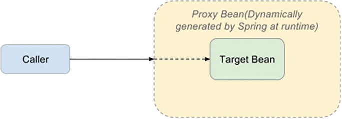

# Java spring boot - AOP(3)


## 1. Spring AOP
- 의존성 추가
```java 
<dependency>
    <groupId>org.springframework.boot</groupId>
    <artifactId>spring-boot-starter-aop</artifactId>
</dependency>
```


## 2. Spring AOP의 Porxy 구현
### (1) Proxy pattern
- 어떠한 객체를 사용하고자 할 때, 객체를 직접적으로 참조하는 것이 아닌 해당 객체를 대변하는 객체를 통해 대상 객체에 접근하는 방식
- 해당 객체가 메모리에 존재하지 않아도 기본적인 정보를 참조하거나 설정할 수 있고, 실제 객체의 기능이 필요한 시점까지 객체의 생성을 미룰 수 있음.
<br><br>

<br><br>


### (2) AOP 프록시 패턴


### (3) 데코레이터 패턴 vs 프록시 패턴


### (4) Proxying Mechanisms
- Spring AOP는 JDK dynamic proxies  또는 CGLIB를 사용하여 주어진 대상 객체에 대한 프록시를 생성
- JDK dynamic proxies 는 JDK에 내장되어 있는 반면, CGLIB는 일반적인 오픈소스 클래스 정의 라이브러리(로 다시 패키징됨 spring-core)