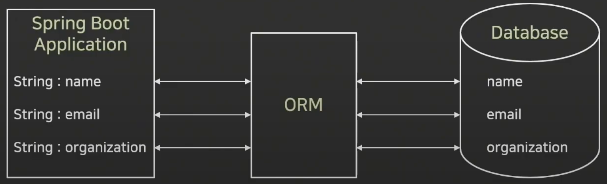
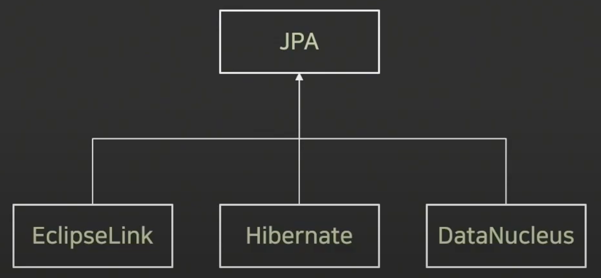
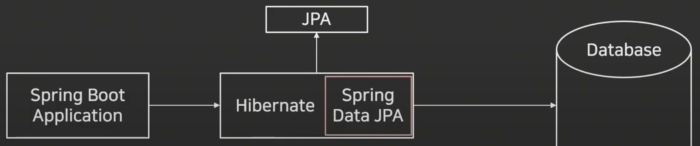
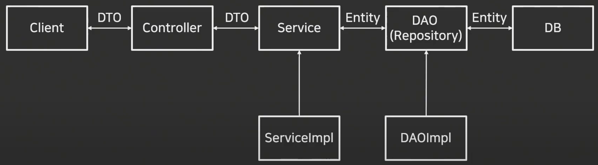

# Java Spring Boot-DBJPA(1)
---
## ORM(Object Relational Mapping)
- 어플리케이션의 객체와 관계형 데이터베이스의 데이터를 자동으로 매핑해주는 것을 의미
  - Java의 데이터 클래스와 관계형 데이터베이스의 테이블을 매핑
- 객체지향 프로그래밍과 관계형 데이터베이스의 차이로 발생하는 제약사항을 해결해주는 역할을 수행
- 대표적으로 JPA가 있음

---

## ORM의 장점
- SQL 쿼리가 아닌 직관적인 코드로 데이터를 조작할 수 있음
  - 개발자가 보다 비즈니스 로직에 집중할 수 있음
- 재사용 및 유지보수가 편리
  - ORM은 독립적으로 작성되어 있어 재사용이 가능
  - 매핑정보를 명확하게 설계하기 때문에 따로 데이터베이스를 볼 필요가 없음
- DBMS에 대한 종속성이 줄어듬
  - DBMS를 교체하는 작업을 비교적 적은 리스크로 수행 가능

---

## ORM의 단점
- 복잡성이 커질 경우 ORM만으로 구현하기 어려움
  - 직접 쿼리를 구현하지 않아 복잡한 설계가 어려움
- 잘못 구현할 경우 속도 저하 발생
- 대형 쿼리는 별도의 튜닝이 필요할 수 있음

---

## JPA(Java Persistance API)
- JPA는 ORM과 관련된 인터페이스의 모음
- Java 진영에서 표준 ORM으로 채택되어 있음
- ORM이 큰 개념이라고 하면, JPA는 더 구체화 시킨 스펙을 포함하고 있음

  #### * JPA를 이용한 개발의 핵심은???
   객체지향을 통해 영속 계층을 처리하는 데에 있음. 즉, JPA를 이용할 때는 테이블과 SQL을 다루는 것이 아니라 데이터에 해당하는 객체를  entitiy 객체라는 것으로 다루고 JPA로 DB와 연동하여 관리하는 것임.

---

### Hibernate
- ORM Framework 중 하나
- JPA의 실제 구현체 중 하나이며, 현재 JPA 구현체 중 가장 많이 사용됨

---

### Spring Data JPA
- Spring Framework에서 entitiy 객체를 이용하여 JPA를 편리하게 이용할수 있도록 제공하는 스프링 관련 라이브러리
- CRUD 처리용 인터페이스 제공(JpaRepository)
- Repository 개발 시 인터페이스만 작성하면 구현 객체를 동적으로 생성해서 주입
- 데이터 접근 계층 개발시 인터페이스만 작성해도 됨

---

## DTO, DAO, Repository, Entity
- Spring Boot 서비스 구조

---

### Entity(Domain)
- 데이터베이스에 쓰일 컬럼과 여러 엔티티 간의 연관관계를 정의
- 데이터베이스의 테이블을 하나의 엔티티로 생각해도 무방함
- 이 클래스의 필도는 각 테이블 내부의 컬럼(Column)을 의미

### Repository
- Entity에 의해 생성된 데이터베이스에 접근하는 메소드를 사용하기 위한 인터페이스
- Service와 DB를 연결하는 고리의 역할을 수행
- 데이터베이스에 적용하고자 하는 CRUD를 정의하는 영역

### DAO(Data Access Object)
- 데이터베이스에 접근하는 객체를 의미
- Service가 DB에 연결할 수 있게 해주는 역할
- DB를 사용하여 데이터를 조회하거나 조작하는 기능을 전담

### DTO(Data Transfer Object)
- DTO는 VO(Value Object)로 불리기도 하며, 계층간 데이터 교환을 위한 객체를 의미
- VO의 경우 Read Only의 개념을 가지고 있음

---

# 소스
- https://github.com/Around-Hub-Studio/AroundHub_SpringBoot/tree/master

# 참고자료
- [스프링 부트(Spring Boot) 기초 강의 몰아보기1편](https://www.youtube.com/watch?v=7t6tQ4KV37g&t=498s)
- [스프링 부트(Spring Boot) 기초 강의 몰아보기2편](https://www.youtube.com/watch?v=1Jc-SD9YrV4)
- <자바 웹 개발 워크북>/프리렉/구멍가게 코딩단 지음

# 단축키
- Override 단축키
  - 컨트롤러 + .
