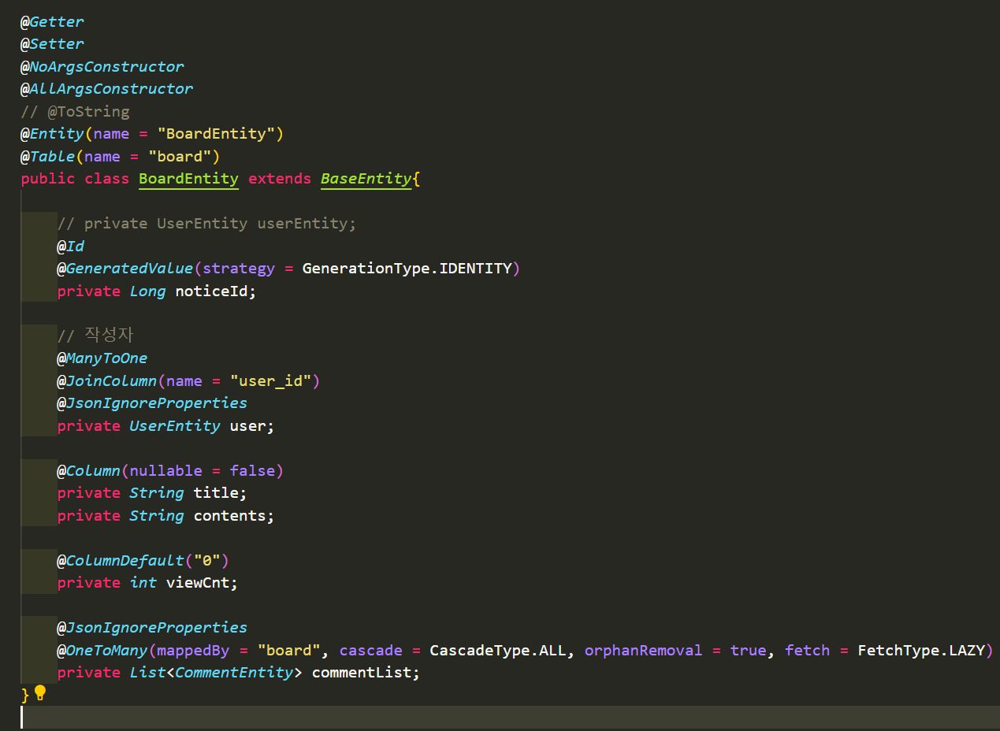

# Java Spring Boot-DBJPA(2)

## Entity 설계
Entity는 JPA에서 데이터베이스의 테이블에 대응하는 클래스
- entity에 anotation을 사용하면 테이블 간의 연관관계를 정의할 수 있음.

---
## 엔티티 관련 기본 어노테이션
### @Entity
 해당 클래스가 entity임을 명시하기 위한 어노테이션

### @Table(name=값)
 엔티티 클래스는 데이블과 매핑되므로 특별한 경우가 아니면 @Table이 필요하지 않으나 클래스의 이름과 테이블의 이름을 다르게 지정할 경우 사용

### @Id
 테이블의 기본값 역할로 모든 엔티티는 @Id 어노테이션이 필요

### @GeneratedValue
 - @Id와 함께 사용
 - 해당 필드 값 생성 방식
 - AUTO / IDENTITY / SEQUENCE/ TABLE

### @Column
 엔티티 클래스의 필드는 자동으로 테이블 칼럼으로 매핑됨

### @Transient
 엔티티 클래스에는 선언된 필드지만 데이터베이스에서 이용하지 않게 설정

---

# 참고자료
- <자바 웹 개발 워크북>/프리렉/구멍가게 코딩단 지음
- <스프링부트 핵심 가이드>/위키북스/장정우 지음

