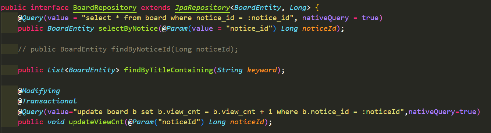

# Java Spring Boot-DBJPA(3)

## JPA Repository 인터페이스

---

## 사용자 정의 쿼리
1. Named Query(@NamedQuery)
2. Query Methods
3. @Query

---

### 1. Named Query
미리 쿼리에 이름을 붙여놓고 사용할 때 쿼리의 이름을 넣어 메서드를 구현하는 방식
- @NamedQuery 사용
- 엔티티 클래스에 정적으로 연결되어 함께 관리됨

---

### [2. JPA Query Method](https://velog.io/@seongwon97/Spring-Boot-Query-Method)
스프링 데이터 JPA는 메소드 이름으로 쿼리 생성을 하는 쿼리 메소드 기능을 제공하는데
- 쿼리 메서드는 메서드의 이름을 분석해서 JPQL 쿼리를 실행한다.
- 쿼리 메서드를 활용하면 쉽게 쿼리문을 만들어 사용할 수 있다.

---
#### Select
```java
    User findByEmail(String email);
    User getByEmail(String email);
    User readByEmail(String email);
    User queryByEmail(String email);
    User searchByEmail(String email);
    User streamByEmail(String email);
    User findUserByEmail(String email);
```

---
#### And, Or
```java
    List<User> findByNameAndEmail(String name, String email);
    List<User> findByNameOrEmail(String name, String email);
```

#### is(Not)Empty, is(Not)Null
```java
    List<User> findByIdIsNotNull();  // Id값에 Null값이 없는지?
    List<User> findByAddressIsNotEmpty();
```

---
#### in
```java
 List<User> findByNameIn(List<String> name);
```
#### StringWith/EndingWith/Contains
```java
    List<User> findByNameStartingWith(String name);
    List<User> findByNameEndingWith(String name);
    List<User> findByNameContains(String name);
    List<User> findByNameLike(String name);
```

---
#### Is, Equals
```java
    Set<User> findUserByNameIs(String name);
    Set<User> findUserByName(String name);
    Set<User> findUserByNameEquals(String name);
```
#### Sorting
```java
    List<User> findTop1ByNameOrderByIdDesc(String name);
    // Id로 내림차순으로 정렬 후 입력 name과 같은 것의 맨 위의 있는 값을 뽑아온다.

    List<User> findFirst2ByNameOrderByIdDescEmailAsc(String name);
    // 여러개의 조건으로 find하는 경우는 And를 사용하였으나 정렬 조건으로 여러개의 값을 사용하는 경우는 And를 사용하지 않고 조건을 이어서 붙인다.

    List<User> findFirstByName(String name, Sort sort);
```

---

### 3. @Query
직접 JPQL(Java Persistence Query Language)을 작성하는 방식


---

# 참고자료
- [Spring Data JPA, Named Query](https://velog.io/@yebali/Spring-Data-JPA-Named-Query)
- [JPA Query Method](https://velog.io/@seongwon97/Spring-Boot-Query-Method)
- <자바 웹 개발 워크북>/프리렉/구멍가게 코딩단 지음
- <스프링부트 핵심 가이드>/위키북스/장정우 지음