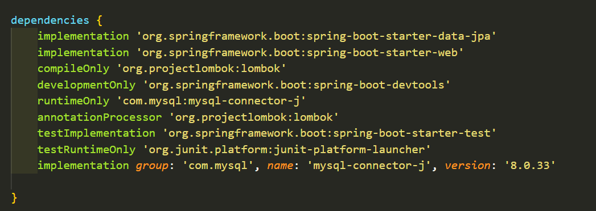

# Java Spring Boot-DBJPA(4)
## JPA 실습
### 1. Spring project 생성(Gradle)
### 2. Spring Data JPA 사용하기 
- [의존성 추가](https://mvnrepository.com/artifact/com.mysql/mysql-connector-j)

### 3. [JPA 설정](https://docs.spring.io/spring-boot/reference/data/sql.html)

```
# Spring Data Source 설정
spring:
    output:
        ansi:
            enabled: always

    # 데이터 베이스
    datasource:
        # 데이터 베이스의 jdbc url
        url: jdbc:mysql://local host/~
        # 데이터 베이스 로그인 사용자 이름
        username: usename
        # 데이터 베이스 로그인 비밀번호 
        password: password
        driver-class-name: com.mysql.cj.jdbc.Driver

    #  데이터 베이스 커넥션
    jpa:
        hibernate:
            # ddl-auto : 데이터베이스 스키마의 자동 생성 및 업데이트 동작을 제어하는 설정
            # true로 설정 : 애플리케이션 실행 중에 데이터베이스 테이블을 자동으로 생성하거나 업데이트할 수 있도록 허용
            ddl-auto: update
        properties:
            hibernate:
                show_sql: true  # 콘솔에 출력
                format_sql: true    # 표기 편하게 설정
```

- <참고> [mysql url 확인 방법](https://stackoverflow.com/questions/4093603/how-do-i-find-out-my-mysql-url-host-port-and-username)

1. my sql 접속
    ```
    mysql -u username -p
    ```
2. 데이터 베이스 목록 확인 및 선택
    ```
    SHOW DATABASES;
    USE examplesdb;
    ```
3. 연결 정보 확인
    ```
    SELECT @@hostname, @@port;
    ```
4. URL 구성
    ```
    jdbc:mysql://hostname:port/databasename
    ```
<참고> mysql url 확인 방법

1. my sql 접속

    ```
    mysql -u username -p
    ```
2. 데이터 베이스 목록 확인 및 선택
    ```
    SHOW DATABASES;
    USE examplesdb;
    ```
3. 연결 정보 확인
    ```
    SELECT @@hostname, @@port;
    ```
4. URL 구성
    ```
    jdbc:mysql://hostname:port/databasename
    ```

### 4. entity

### 5. repository

### 6. DAO


---
