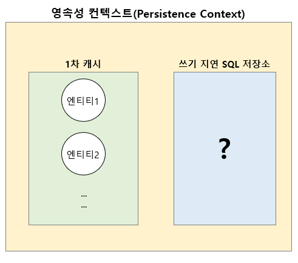
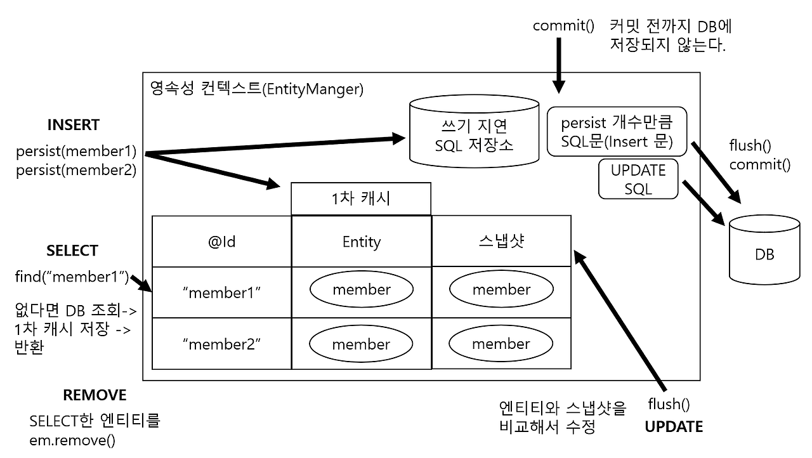
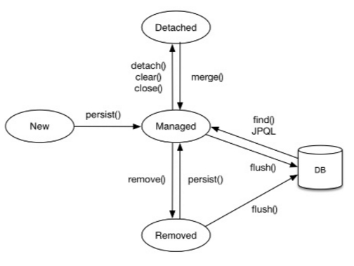

# Java Spring Boot-DBJPA(5)

## 1. JPA의 중요성

### JPA(Java Persistence API)
- 자바 ORM 기술에 대한 표준 명세
- 데이터베이스와 객체 지향 프로그래밍 사이의 패러다임 불일치를 해결

    > JPA는 개발자가 직접 SQL을 작성하는 대신에, 객체와 클래스를 데이터베이스 테이블에 매핑함으로써 데이터 접근을 추상화하고 간소화

<br>

---

## 2. 영속성 컨텍스트
### (1) 영속성 컨텍스트(Persistence Context)
- 엔티티(Entity)를 영구 저장하는 환경
- 애플리케이션과 데이터베이스 사이에서 객체를 보관하는 가상의 데이터베이스 같은 역할<br><br>

---

### (2) 장점
### 1) 1차 캐시(First-Level Cache)
  - 한 트랜잭션 내에서 동일한 엔티티에 대한 반복적인 조회 요청이 발생할 경우 데이터베이스가 아닌 캐시에서 데이터를 제공

  - 1차 캐시의 키는 식별자 값(데이터베이스의 기본 키)이고 값은 엔티티 인스턴스<br><br>

### 2) 동일성 보장- 조회 : find()
```Java
Member a = em.find(Member.class, "member1");
Member b = em.find(Member.class, "member1");
System.out.print(a==b) // true
```
- member1에 해당하는 Entity를 2번 조회하면 1차 캐시에 의해 같은 Reference 로 인식
- 즉, 같은 객체를 2번 조회해도 실제로는 한 번만 DB에서 조회하고 두 번째 조회부터는 영속성 컨텍스트(1차 캐시)를 사용<br><br>


### 3) 쓰기 지연(transactional write-behind)


```Java
EntityManager em = EntityManagerFactory.createEntityManager();
EntityTransaction tx = em.getTransaction(); // 트랜잭션

tx.begin();     // 트랜잭션 시작
Member member = new Member();   // 비영속
member.setId("member1");
member.setUsername("홍길동");
em.persist(member);     // 영속

tx.commit();    // 엔티티 등록
```
<br>

- persist() : 영속 컨텍스트의 1차 캐시에 member 엔티티가 저장되고, 쓰기 지연 SQL 저장소에는 member 엔티티의 INSERT SQL 쿼리문이 저장됨
- txcommit() : 쓰기 지연 SQL 저장소에 저장된 INSERT SQL 쿼리를 보내 데이터베이스에 저장됨
<br><br>


<p align="center">
  
</p><br><br>


### 4) 변경 감지(Dirty Checking)
- 영속성 컨텍스트에 저장된 엔티티와 실제 DB에 저장된 데이터와 차이가 있는지 체크
- 변경 감지는 영속성 컨텍스트가 관리하는 영속 상태의 엔티티만 적용
- flush() : 영속성 컨텍스트의 변경 내용을 데이터베이스에 반영<br><br>


```Java
EntityManager em = EntityManagerFactory.createEntityManager();
EntityTransaction tx = em.getTransaction();     // 트랜잭션
tx.begin();     // 트랜잭션 시작

Member member = em.find(Member.class, "member");    // member 조회
member.setUsername("hello");
member.setAge("20");

tx.commit();    // 엔티티 등록
```

<br><br>
<p align="center">
  
</p><br><br>

---

## 3. EntityManagerFactory / EntityManager
### 1) EntityManagerFactory
- 'EntityManager 객체를 생성하는 팩토리 역할
- 생성하는데 비용이 매우 큰 객체이므로, 어플리케이션 시작 시 한 번만 생성하고 종료 시까지 재사용함
- 어플리케이션 전체에서 하나만 생성하여 사용
- 서로 다른 스레드 간에 공유 가능(thread-safe)

### 2) EntityManager
- 실제로 데이터베이스와 상호작용하는 객체
- 영속성 컨텍스트를 관리
- 생성하는데 비용이 거의 들지 않음
- 여러 스레드가 동시에 접근하면 동시성 문제가 발생하기 때문에 스레드 간 공유가 불가능

```Java
// EntityManagerFactory 생성
EntityManagerFactory emf = Persistence.createEntityManagerFactory("example-unit");

// EntityManager 생성
EntityManager em = emf.createEntityManager();

em.getTransaction().begin();

// 데이터베이스 작업 수행
Member member = em.find(Member.class, 1L);

em.getTransaction().commit();

// EntityManager 종료
em.close();

// EntityManagerFactory 종료 (애플리케이션 종료 시)
emf.close();
```
<br>

## 4. 엔티티 생명주기
<p align="center">
  
</p><br>

- 비영속(new/transient) : 영속성 컨텍스트와 전혀 관계가 없는 새로운 상태
- 영속(managed) : 영속성 컨텍스트에 관리되는 상태
- 준영속(detached) : 영속성 컨텍스트에 저장되었다가 분리된 상태
- 삭제(remove) : 삭제된 상태
<br><br><br>


(비영속)

```Java
// 객체 를 생성한 상태
Member member = new Member();
member.setId("member1");
member.setUsername("홍길동");
```

(영속)
``` Java
EntityManager em = EntityManagerFactory.createEntityManager();
em.getTransaction().begin();

Member member = new Member();
member.setId("member1");
member.setUsername("홍길동");

// 객체를 영속성 컨텍스트에 저장(영속)
em.persist(member);
```

(준영속)
```Java
// member 엔티티를 영속성 컨텍스트에서 분리(준영속)
em.detach(member);
```

(삭제)
``` Java
// 객체를 삭제한 상태(삭제)
em.remove(member);
```
---

# 참고자료
- [IT is True-\[JPA\] 영속성 컨텍스트(Persistence Context)란? - 개넘 정리 및 사용법](https://ittrue.tistory.com/254)
- [개발자의 공부 기록 - \[JPA\] EntityManager와 EntityManagerFactory](https://sweets1327.tistory.com/60)
- [\[JPA\] 영속성 컨텍스트(Persistence Context)란?](https://jhyonhyon.tistory.com/36)
- <자바 ORM 표준 JPA 프로그래밍>/페이퍼백/김영한 지음


